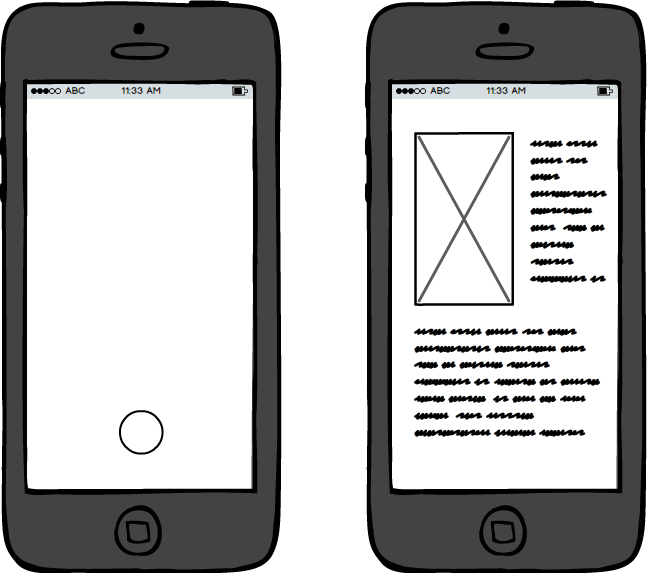

## Concept
Een app die het mogelijk maakt om de voorkant (of eventueel achterkant) van een boek te scannen, om hierbij extra informatie op te halen over dit boek. Denk hierbij bijvoorbeeld aan een samenvatting, of andere boeken van de zelfde schrijver.

## Sensoren
http: https://openlibrary.org/developers/api  
Sensor 1: OCR https://ionicframework.com/docs/native/ocr  
Sensor 2: Document scanner https://ionicframework.com/docs/native/document-scanner  

## Technische details
Om een boek te kunnen scannen gebruiken we de document scanner uit de Ionic native library. Vervolgens kunnen de titel en de auteur uitgelezen worden door middel van OCR. De titel en de auteur kunnen vervolgens opgestuurd worden naar de openlibrary api om hier extra informatie op te halen.

## Wireframe
De app zal bestaan uit 2 schermen, in het eerste scherm is het mogelijk voor de gebruiker om het boek te scannen. Het tweede scherm is een detail view waar de opgehaalde informatie over het boek getoont kan worden.

## Eventuele uitbereidingen
Als eventuele uitbereiding voor app 3 is het mogelijk om de gebruiker een boek te laten opslaan zodat deze informatie later makkelijk weer op te halen is.

